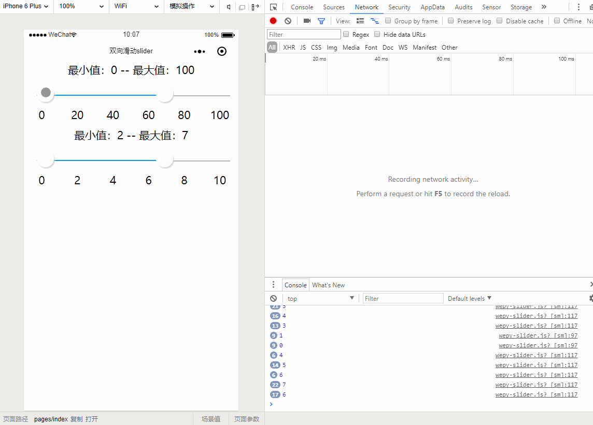

# wepy-double-slider
wepy框架微信小程序双向滑动slider
微信小程序双向滑动slider，可用于价格范围选取等功能。

参考 [weixianlove/zy-slider](https://github.com/weixianlove/zy-slider)
用wepy框架改写了原生的插件
因为不熟悉 SelectorQuery wx.createSelectorQuery()微信小程序的选择器
目前还有一个问题 页面有多个时，会同时响应事件，有兴趣的朋友可以一起看看代码
感谢！

