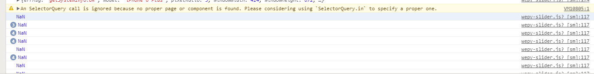

# wepy-double-slider
wepy框架微信小程序双向滑动slider

微信小程序双向滑动slider，可用于价格范围选取等功能。

## 说明
我只是大自然搬运工。搬运于原生小程序双向滑动组件 [weixianlove/zy-slider](https://github.com/weixianlove/zy-slider)


用wepy框架改写了原生的组件

因为不熟悉 SelectorQuery wx.createSelectorQuery()微信小程序的选择器

```javascript
在原生中onReady事件中wx.createSelectorQuery().in(this)可以正式使用

移植到wepy框架中我放在onLoad事件中wx.createSelectorQuery().in(this)无法正确获取
 const quer = wx.createSelectorQuery();//滑块元素 在wepy框架中可正常使用
 const quer = wx.createSelectorQuery().in(this);//滑块元素 在wepy框架中报错见下图

```


#### 问题 
页面有多个组件时，会同时响应事件，有兴趣的朋友可以调试下代码看看问题

感谢！

